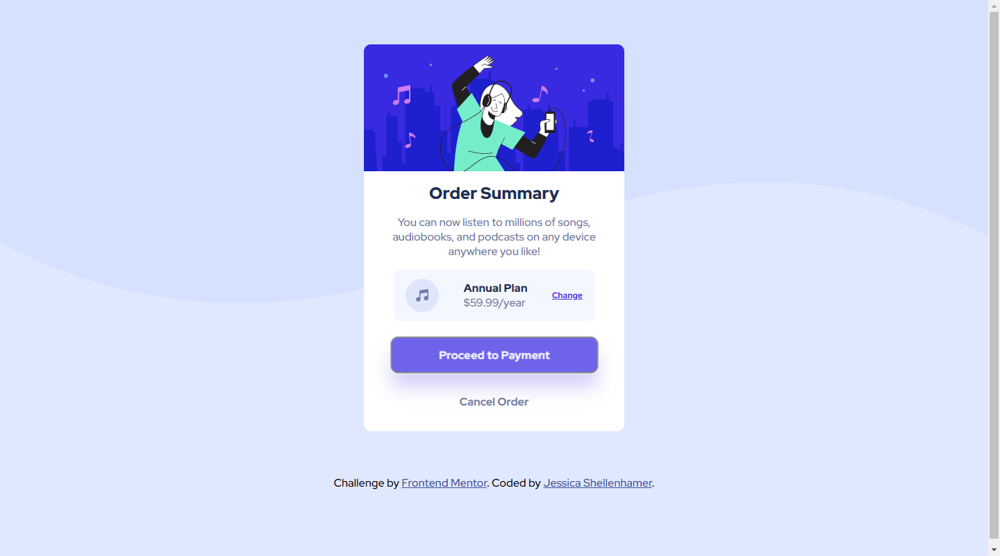

# Frontend Mentor - Order summary card solution

This is a solution to the [Order summary card challenge on Frontend Mentor](https://www.frontendmentor.io/challenges/order-summary-component-QlPmajDUj). Frontend Mentor challenges help you improve your coding skills by building realistic projects.

## Table of contents

- [Overview](#overview)
  - [The challenge](#the-challenge)
  - [Screenshot](#screenshot)
  - [Links](#links)
- [My process](#my-process)
  - [Built with](#built-with)
  - [What I learned](#what-i-learned)
  - [Continued development](#continued-development)
  - [Useful resources](#useful-resources)
- [Author](#author)

## Overview

### The challenge

Users should be able to:

- See hover states for interactive elements

### Screenshot

### Links

- Solution URL: [Add solution URL here](https://your-solution-url.com)
- Live Site URL: [https://perezjprz19.github.io/order-summary-component-main/](https://your-live-site-url.com)

## My process

During my last project I had a hard time with overflow on very narrow devices. So this project, I
really focused on the mobile first-approach, even more so than before.

### Built with

- Semantic HTML5 markup
- CSS custom properties
- Flexbox
- Mobile-first workflow

### What I learned

<ul>
  <li> border-radius takes 4 value </li>
</ul>

### Continued development

My main struggle during this challenge was getting the paragraph aligned correctly. I forgot text-align existed in CSS. It didn't need to be as complicated as I was making it. I think I need to focus on not overthinking the simple things.

### Useful resources

-https://css-tricks.com/almanac/properties/b/border-radius/ - This helped me because I needed to set only the top border-radius for the image on the card and I wasn't aware I could specify the radius for each border individually. It was very quick to grasp the concept at a glance.

## Author

- Frontend Mentor - [@perezjprz19](https://www.frontendmentor.io/profile/perezjprz19)
- Twitter - [@perezjprz19](https://www.twitter.com/perezjprz19)
